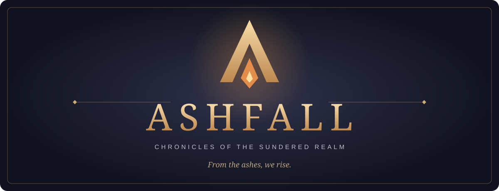

# Ashfall — The Sundered Realm

Build an estate, recruit and equip an army, complete expeditions and meet other rulers in an original fantasy kingdom RPG. **0.15.0 is the latest friends test.** Existing Sundered Realm accounts and progress are preserved.

**[Play in your browser](https://ashfall.d3mon.gg)** · **[Download Android 0.15.0](https://github.com/uhd3mon/ashfall-game/releases/tag/android-v0.15.0)** · **[Report an issue](https://github.com/uhd3mon/ashfall-game/issues)**

## Start playing

1. Register with your email, password and password confirmation.
2. Choose a player name, Human/Orc/Elf, Male/Female appearance and Warrior/Mage/Rogue class.
3. Follow the Kingdom guide through quests, income, recruitment, equipment and practice battles.

The level cap is **200**, across five regions and 400 quests. Actual level-ups refill Health, Mana and Spirit. Daily objectives reset at **00:00 UTC**. Vault deposits are free; withdrawals cost **2%**, rounded up to whole Silver.

Your estate shows owned buildings and their counts. Home includes world/guild chat, daily objectives and events. Guilds have short tags, applications and officers. PvP is automatic from level 1. Low-health protection, recovery shields, level/power matching and daily repeat-attack limits protect players from repeated raids. Bounties and consent-based guild wars unlock as you progress. An original orchestral theme, sound effects and layered kingdom ambience can be adjusted or muted in Settings.

## Android

Download `ashfall-0.15.0-android.apk` from the release above and open it on your phone. Allow installation from your browser/file manager if Android asks. Requires **Android 7 or later** and an internet connection.

This signed APK uses the same application ID and signing key as the previous signed release and can update it. It connects to the same HTTPS realm as desktop browsers. Existing signed installations also load the updated server UI; this APK refreshes the packaged fallback assets.

## Testing limits

This is an early friends test. Balance and features may change. Market buying/listing remains locked because email verification delivery is unfinished. Password recovery delivery is not available yet. Paid purchases are disabled. Advanced matchmaking, seasons and Chronicle rewards are unfinished.

Please include your device, browser/app version, the steps you took and a screenshot when reporting a bug. Never post passwords, private messages or personal account details in public issues.

This repository contains only player documentation, branding and downloadable release assets. Game source code, credentials and player data are private. GitHub’s “Source code” downloads contain this documentation, not the game source.
